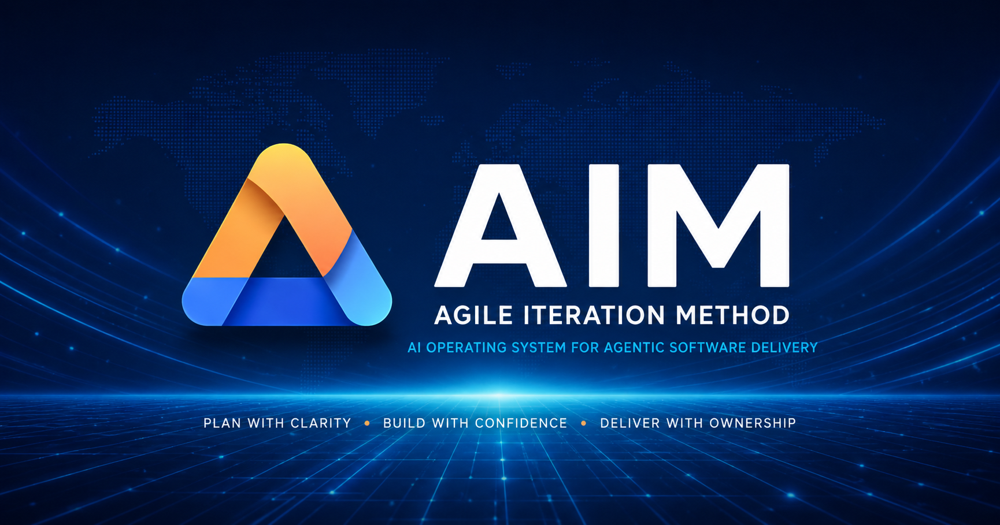

# Agile Iteration Method (AIM) 2.0



**A structured AI delivery system for building real software with clarity, quality, and human control.**

AIM helps you turn a desired outcome into reviewed, validated increments instead of an expanding prompt conversation.
It works with Codex, Claude, and GitHub Copilot, adapts to the repository in front of it, and keeps important decisions visible.

## Install AIM

From the repository where you want to use AIM, run the public release bootstrap:

```bash
curl -fsSL https://joneri.github.io/agile-iteration-method/install.sh | bash
```

The bootstrap fetches the current maintained `main` archive and starts the
guided installer. The installer asks which repository to install AIM into; it
does not assume your current shell directory is the target repository.

To test a specific branch or tag:

```bash
curl -fsSL https://joneri.github.io/agile-iteration-method/install.sh | AIM_REF=main bash
```

For automation, pass the target explicitly:

```bash
curl -fsSL https://joneri.github.io/agile-iteration-method/install.sh | bash -s -- --target /path/to/repo --non-interactive
```

## Already Have AIM 1.x Or Older AIM Files?

If a target repository already contains AIM runtime files, helper prompts,
commands, or adapter packages, use the packaged upgrade path before continuing:

```text
/aim upgrade
```

Upgrade refreshes installed AIM-owned surfaces through the reviewed installer
plan and preserves active `.aim/` runtime state. If the installed command surface
is stale or unavailable, rerun the public bootstrap first. After upgrade, run
`/aim calibrate-repo` when repository knowledge may have changed, then resume
with `/aim continue` if an Epic was already in progress.

## What AIM Does

AIM brings planning, implementation, review, correction, validation, and approval into one repeatable delivery loop:

```text
Product intent -> next useful increment -> implementation -> review -> validation -> approval
```

In practice, AIM helps you:

- build what you actually asked for
- keep work aligned to an Epic and the current increment
- detect mistakes before they become accepted work
- reuse repository knowledge without loading everything into every session
- choose how much context and verification the work deserves
- keep people in control of scope, risk, and completion

## What AIM Is Not

AIM is not:

- a programming language, framework, or hosting platform
- a replacement for tests, CI, engineering judgment, or product ownership
- a promise that AI output is automatically correct
- a requirement to commit a large process framework into every repository

AIM gives AI-assisted work a delivery structure.
Your existing tools and engineering standards remain part of the evidence AIM uses.

## Why AIM Exists

AI coding tools are fast, but speed alone does not keep work coherent.
Long sessions can drift from the goal, forget earlier decisions, accumulate unnecessary context, and produce changes that look complete before they have been reviewed.

AIM responds with a few durable ideas:

- one clear Epic describes the outcome
- one Done Increment is built at a time
- review and validation happen before acceptance
- repository facts are reused instead of repeatedly rediscovered
- deeper context is loaded only when the work needs it
- humans retain meaningful approval points

The result is less guesswork and a clearer path from idea to accepted software.

## Quality First

AIM does not stop at generation.

Each increment moves through implementation, review, technical validation, and product acceptance.
When evidence shows the work is wrong or incomplete, the increment returns for correction instead of quietly moving forward.

This does not make AI infallible.
It makes verification and repair part of the normal workflow.

## Repository-Aware Without Context Bloat

AIM can learn the repository's:

- technologies and commands
- test and validation paths
- important folders
- conventions and risk zones
- documents that matter for specific work
- remembered team or personal habits

Shared repository knowledge can live in the small `aim.profile.yaml` profile.
Personal hints stay outside the repository.
Detailed operational guidance loads only when relevant, and active work state stays separate under `.aim/`.

Your tokens are valuable.
AIM is designed to reuse compact knowledge, start with the smallest useful context, and expand only for evidence, uncertainty, or risk.

## Human Control

AIM has two execution styles:

- **Strict** pauses at the important approval gates.
- **Auto** continues between increments when the direction remains clear, but preserves review, escalation, traceability, and explicit approval before the Epic is closed.

People still own product intent, scope changes, trust decisions, and final acceptance.

## Personal, Team, and Enterprise

| Mode | Best for | Default posture |
| --- | --- | --- |
| **Personal** | solo work, trials, personal repositories | maximum freedom; sharing is the user's choice |
| **Team** | shared repository understanding | small, deliberate, reviewable sharing |
| **Enterprise** | protected or stricter environments | isolate AIM internals unless sharing is explicitly approved |

The AIM workflow stays familiar across all three modes.
The difference is what is shared and how cautiously AIM touches the repository.

## Codex, Claude, and GitHub Copilot

AIM keeps one method while using a native entrypoint for each platform:

| Platform | Native start |
| --- | --- |
| **Codex** | install the AIM skill, then use `/aim start "EPIC: ..."` |
| **GitHub Copilot** | select the AIM agent, then use `/aim start "EPIC: ..."` |
| **Claude** | use the installed AIM command, or state the Epic explicitly |

If a native command is unavailable, explicit AIM intent remains the supported fallback.
Platform packaging may differ; the delivery loop, gates, ownership, and acceptance rules do not.

## AIM 2.0

AIM 2.0 is the current release. See the [changelog](CHANGELOG.md) for what shipped and the [release and publication model](docs/workflow/release-publication-model.md) for how releases are validated.

AIM 2.0 was rebuilt as a cleaner product while preserving the proven AIM core.

The rewrite separates:

- workflow behavior
- repository awareness
- active runtime state
- installation
- platform adapters

That makes AIM easier to install, safer to place in existing repositories, and cheaper to operate across repeated sessions.

The guided installer provides:

- filesystem path completion
- mode and adapter selection menus
- a compact preview
- file-by-file collision decisions
- final confirmation before writing
- rollback-protected, idempotent apply
- JSON and non-interactive modes for automation

## Start in Six Steps

1. **Install AIM**

   ```bash
   curl -fsSL https://joneri.github.io/agile-iteration-method/install.sh | bash
   ```

   If AIM is already installed, or the repository still has AIM 1.x-era files, run `/aim upgrade` before continuing.

2. **Calibrate repository awareness**

   ```text
   /aim calibrate-repo
   ```

3. **Start an Epic**

   ```text
   /aim start "EPIC: <the outcome you want>"
   ```

4. **Review Gate A**

   Confirm the outcome, boundaries, and acceptance intent.

5. **Approve the next increment**

   AIM proposes one useful, reviewable slice at a time.

6. **Build with confidence**

   AIM implements, reviews, validates, corrects when needed, and returns the result for acceptance.

## Read Next

- [Product overview](docs/product/README.md)
- [Why AIM is different](docs/product/what-is-aim.md)
- [First-time journey](docs/product/getting-started.md)
- [Platforms and adoption modes](docs/product/platforms-and-adoption.md)
- [Installation guide](docs/workflow/install-aim-2.0.md)
- [Release and publication model](docs/workflow/release-publication-model.md)
- [Canonical workflow](docs/workflow/agile-iteration-method.md)

## Documentation Map

- `docs/product/`: public product story and newcomer guidance
- `docs/workflow/`: canonical AIM behavior, installation, and operating guidance
- `docs/features/`: advanced support and reference material
- `.github/workflows/release-readiness.yml`: independently runnable public release gate
- `CONTRIBUTING.md`: AIM source-repository maintainer guidance only

## License

Documentation is licensed under [CC BY 4.0](LICENSE).

Created by Jonas Eriksson with contributions from the AIM community.
