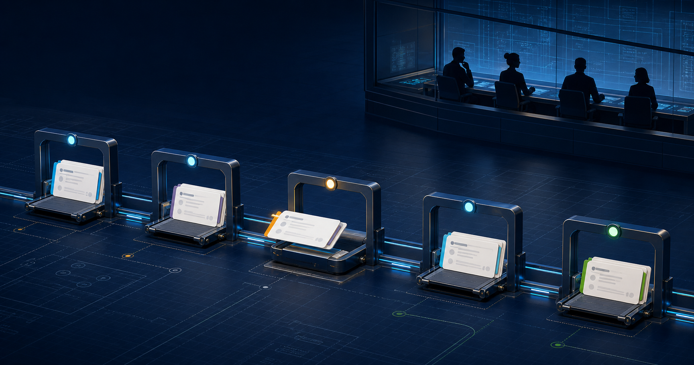

# Agile Iteration Method (AIM) 2.9


AIM is a delivery method for AI-assisted software work. You describe the outcome. AIM plans one useful increment, builds it, reviews it, validates it, and asks for the decisions that still belong to you.

It works with Codex, Claude Code, and GitHub Copilot.

## Install

Install the complete, self-contained AIM Agent Skill through the open skills ecosystem:

[](https://skills.sh/joneri/agile-iteration-method)

```bash
npx skills add joneri/agile-iteration-method \
  --skill agile-iteration-method
```

This is full AIM, not AIM Lite. The package is generated from the same canonical workflow, adapter, installer, and schema sources as the adaptive AIM distribution. It does not require a separate AIM npm publication.

Target one supported agent explicitly when needed:

```bash
# Codex
npx skills add joneri/agile-iteration-method \
  --skill agile-iteration-method --agent codex --yes

# GitHub Copilot
npx skills add joneri/agile-iteration-method \
  --skill agile-iteration-method --agent github-copilot --yes

# Claude Code
npx skills add joneri/agile-iteration-method \
  --skill agile-iteration-method --agent claude-code --yes
```

Update an installed public skill with:

```bash
npx skills update agile-iteration-method --yes
```

The adaptive AIM installer remains available when you want reviewed repository calibration, native project specialists, or a broader supplier-specific footprint. Clone the public source so you can inspect exactly what will run:

```bash
git clone --depth 1 https://github.com/joneri/agile-iteration-method.git aim-source
cd aim-source
python3 scripts/aim_install.py --dry-run
```

Review the source and preview, then rerun with `--apply` only when the plan is correct. The installer asks for a repository and the adapters you use. Native project specialists can also be refreshed later through `/aim configure-agents` from `aim.roles.yaml`.

Already using AIM? Run:

```text
/aim upgrade
```

## Start

First verify the repository knowledge AIM will reuse:

```text
/aim calibrate-repo
```

Record a durable project rule when AIM should remember it on later runs:

```text
/aim remember-repo habits "Keep user-facing language direct and calm."
```

Turn completed AIM work into reviewable knowledge candidates:

```text
/aim reflect
/aim reflect-all
```

Reflect verifies historical lessons against current repository evidence, preserves provenance and contradictions, and keeps promotion under your control. It finishes by saying whether action is recommended and gives one concrete next step—or states that nothing needs to be remembered or forgotten. `reflect-all` previews its local project inventory before analyzing the selected set and never modifies discovered repositories.

Then start with an outcome, not a task list:

```text
/aim start "EPIC: Make checkout recovery clear and reliable when payment confirmation is delayed"
```

Use `/aim help` when you want the next useful action. The same command family also covers continue, status, validation, configuration, upgrade, memory, execution mode, cost depth, and replanning. Populate several planned Epic cards with `/aim to-backlog`, then open the current repo's read-only [AIM UI control room](docs/product/aim-ui.md) with `/aim ui`; use `/aim ui start /path/to/repo` for another repository.

## How AIM works

```text
PO -> TDO -> Dev -> Reviewer -> TDO -> PO
```

- **PO** owns the outcome and acceptance.
- **TDO** chooses the next end-to-end Done Increment and validates delivery.
- **Dev** implements the approved increment.
- **Reviewer** looks for correctness problems, regressions, and risk.

Gate A approves the Epic. Gate B approves the next increment. Gate E accepts the result. Review and technical validation happen before acceptance.

`Strict` pauses at every hard gate. `Auto` continues while the approved direction remains clear, but still stops for risk, scope changes, and final Epic acceptance.

## Repository-aware, not repository-heavy

AIM keeps four things separate:

| Surface | Purpose |
| --- | --- |
| `docs/workflow/agile-iteration-method.md` | canonical AIM method |
| `aim.profile.yaml` | reusable repository knowledge |
| `aim.roles.yaml` | project-specific PO, TDO, Dev, and Reviewer expertise |
| `.aim/` | active local runtime state and review evidence |

The standard installation adds the selected supplier skills and native project specialists. It never needs to create `AGENTS.md` or `CLAUDE.md`.

## Native adapters

| Platform | AIM skill | Project specialists |
| --- | --- | --- |
| Codex | `~/.agents/skills/agile-iteration-method/` | `.codex/agents/aim-*.toml` |
| Claude Code | `.claude/skills/aim/` | `.claude/agents/aim-*.md` |
| GitHub Copilot | `.github/skills/aim/` | `.github/agents/aim-*.agent.md` |

All adapters use the same AIM roles, gates, state ownership, and `/aim` command semantics. Supplier-specific files define how each project specialist works.

## Smarter output from the start

AIM applies **audience-context integrity** to everything it generates: write the intended current meaning for the reader, and keep private conversations, rejected drafts, prompts, AI mistakes, and review feedback out of product copy, UI, code comments, and documentation. Changelogs and other intentionally historical artifacts keep the history their audience actually needs.

## What is new in v2.9.6

AIM now moves from an accepted Increment to the next Gate B checkpoint through
one schema-validated atomic state replacement. The new Increment, Gate A
checkpoint, and canonical `gate_b_pending` status therefore appear together.

If a bounded status-only deviation still slips through, AIM UI shows a calm
`Status updating` work-in-progress card without granting Gate authority. Invalid
or compound runtime state continues to fail closed.



See the [AIM UI Beta guide](docs/product/aim-ui.md), or launch it with `/aim ui`.
AIM Reflect still **goes beyond memory cleanup for repository work** through
verified provenance and user-owned promotion. The AIM runtime contract remains
2.0; product, runtime, installer, and schema versions stay separate.

## Safety

- one main AIM thread owns `.aim/state.json` and gate transitions
- native specialists never accept work or create parallel AIM runtimes
- existing files are collision-protected
- apply is rollback-protected and idempotent
- unavailable native delegation falls back to the same sequential role loop
- tags, releases, deploys, and other external changes still need explicit scope

## Documentation

- [Feature guide](docs/product/features.md) · [AIM UI control room](docs/product/aim-ui.md) · [First-time journey](docs/product/getting-started.md)
- [Platforms and project specialists](docs/product/platforms-and-adoption.md) · [Install and upgrade](docs/workflow/install-aim-2.0.md) · [Canonical AIM method](docs/workflow/agile-iteration-method.md)
- [AIM Reflect](docs/workflow/reflection.md) · [Troubleshooting](docs/workflow/troubleshoot-aim-2.0.md) · [Release and publication](docs/workflow/release-publication-model.md) · [Public Agent Skill distribution](docs/workflow/version-and-installation.md)

Current product release: **v2.9.6**. See [CHANGELOG.md](CHANGELOG.md).

Documentation is licensed under [CC BY 4.0](LICENSE).
